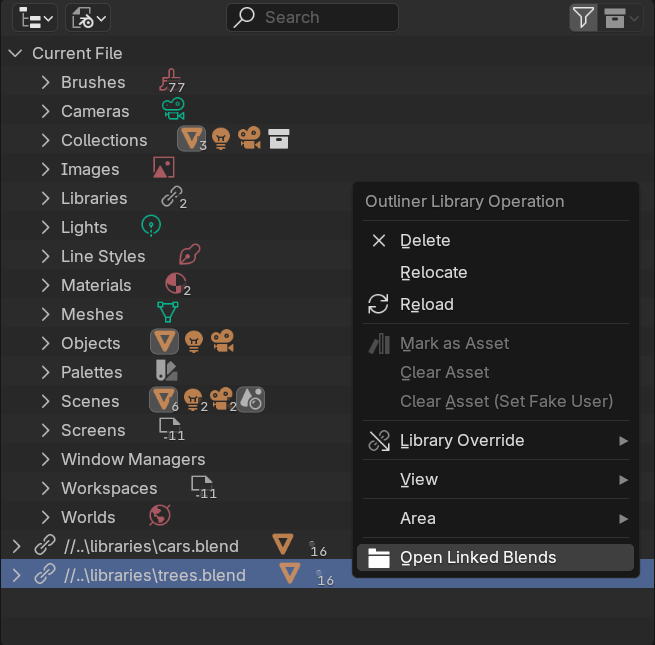

  <h3 align="center">Open Linked</h3>
  Open linked blends from the Outliner.
   
   
  <a href="#about"><strong>Check out the screenshots »</strong></a>
   
  <a href="https://github.com/polygoniq/open_linked/issues/new?assignees=&labels=bug&template=01_BUG_REPORT.md&title=bug%3A+">Report a Bug</a>
  ·
  <a href="https://github.com/polygoniq/open_linked/issues/new?assignees=&labels=enhancement&template=02_FEATURE_REQUEST.md&title=feat%3A+">Request a Feature</a>
  ·
  <a href="https://github.com/polygoniq/open_linked/issues/new?assignees=&labels=question&template=04_SUPPORT_QUESTION.md&title=support%3A+">Ask a Question</a>
   

  
  
  

Table of Contents

- [About](#about)
- [Getting Started](#getting-started)
  - [Installation via Blender Extensions](#installation-via-blender-extensions)
  - [Installation via ZIP](#installation-via-zip)
    - [Download the addon ZIP](#download-the-addon-zip)
    - [Install ZIP in Blender](#install-zip-in-blender)
      - [Blender 4.2 and newer](#blender-42-and-newer)
      - [Blender 4.1 and older](#blender-41-and-older)
  - [Updating](#updating)
- [Roadmap](#roadmap)
- [Support](#support)
- [Project assistance](#project-assistance)
- [Contributing](#contributing)
- [License](#license)

---

## About

> A small Blender add-on for opening linked blends directly from the Outliner window. Open selected
> linked libraries effortlessly thanks to the right-click menu in the Outliner.
>

  
Screenshots

   
  

## Getting Started

### Installation via Blender Extensions

> [!NOTE]
> You need [Blender 4.2 LTS or higher](https://blender.org). Windows, macOS 10 and Linux are
> supported.

Go to the [Blender Extensions add-on page](https://extensions.blender.org/add-ons/open_linked/),
click `Get Add-on` and `drag&drop` it into Blender.

### Installation via ZIP

> [!NOTE]
> You need [Blender 3.3 LTS or higher](https://blender.org). Windows, macOS 10 and Linux are
> supported.

#### Download the addon ZIP

|                          Stable Release                                                  |                         Unstable Master Branch                   |
| :--------------------------------------------------------------------------------------: | :--------------------------------------------------------------: |
| Head over to [Releases](https://github.com/polygoniq/open_linked/releases) for a stable ZIP.  | Click `Code` -> `Download ZIP` if you are feeling adventurous.   |

#### Install ZIP in Blender

##### Blender 4.2 and newer
Or go to `Edit` -> `Preferences` and select `Extensions` in the left bar. Click the small arrow in
the top-right corner and select `Install from Disk`. Select the ZIP file you just downloaded and
click `Install from Disk`. After the installation finishes, check the checkbox next to the `Open
Linked` addon.

##### Blender 4.1 and older
Go to `Edit` -> `Preferences`. And select `Add-ons` in the left bar. Click the `Install...` button
in the top section. Select the ZIP file you just downloaded and click `Install Add-on`. After the
installation finishes, check the checkbox next to the `Open Linked` addon.

### Updating

Available for Blender 4.2 and newer through the Blender Extensions. Navigate to `Edit` ->
`Preferences` and select `Extensions` in the left bar. Write `Open Linked` in the top search bar,
expand the panel and click on `Update`.

If you cannot see the `Update` button even though you know you're not on the latest version
available, click the small arrow in the top-right corner and select `Check for Updates`.

## Roadmap

See the [open issues](https://github.com/polygoniq/open_linked/issues) for a list of proposed features (and known issues).

- [Top Feature Requests](https://github.com/polygoniq/open_linked/issues?q=label%3Aenhancement+is%3Aopen+sort%3Areactions-%2B1-desc) (Add your votes using the 👍 reaction)
- [Top Bugs](https://github.com/polygoniq/open_linked/issues?q=is%3Aissue+is%3Aopen+label%3Abug+sort%3Areactions-%2B1-desc) (Add your votes using the 👍 reaction)
- [Newest Bugs](https://github.com/polygoniq/open_linked/issues?q=is%3Aopen+is%3Aissue+label%3Abug)

## Support

Reach out to the maintainers at one of the following places:

- Joining our [Discord community](https://polygoniq.com/discord/) for the fastest support.
- [GitHub issues](https://github.com/polygoniq/open_linked/issues/new?assignees=&labels=question&template=04_SUPPORT_QUESTION.md&title=support%3A+)
- Contact options listed on [this GitHub profile](https://github.com/polygoniq)

## Project assistance

If you want to say **thank you** or/and support active development of Open Linked add-on:

- Add a [GitHub Star](https://github.com/polygoniq/open_linked) to the project.
- Rate add-on on [Blender Extensions](https://extensions.blender.org/add-ons/open_linked/) page
- Tweet about the add-on.

Together, we can make Open Linked add-on **better**!

## Contributing

First of, thanks for taking the time to contribute! Contributions are what make the open-source
community such an amazing place to learn, inspire, and create. Any contributions you make will
benefit everybody else and are **greatly appreciated**.

Please read [our contribution guidelines](docs/CONTRIBUTING.md), and thank you for being involved!

## License

This project is licensed under the **GNU General Public License v3**.

See [LICENSE](LICENSE) for more information.